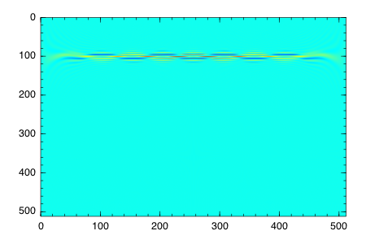
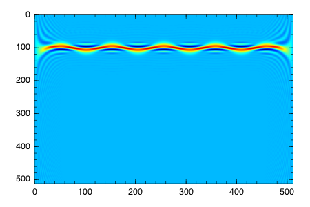

juwvid
===========

Julia codes for Cohen's class distribution. Currently, it's under development and functions available are very limited. I imported the Wigner-Ville distribution and the pseudo Wigner-Ville distribution from MATLAB GPL programs, tftb-0.2. Regarding tftb, visit http://tftb.nongnu.org/ .

Requirement
----------------------
- Julia v0.4

Julia Packages 
------------------------
- DSP
- IJulia, Winston, Color (just for showing a sample)

Available 
------------------------

- Wigner-Ville distribution
- Pseudo Wigner-Ville distribution

Planned 
------------------------

- smoothed pseudo Wigner-Ville distribution
- polynomial WV (possibly)

- Wigner-Ville

-Pseudo Wigner Ville

